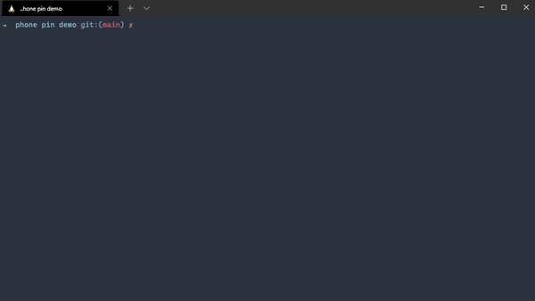

# Phone Pin Demo
This application simulates cracking a phone pin.



Contents
========

 * [Why?](#why)
 * [Requirements](#requirements)
 * [Installation](#installation)
 * [Features](#features)
 * [To-Do](#to-do)

### Why?
---
- To demonstrate how easily a phone pin could be cracked even with a simple program such as this under the right circumstances.
- Could be modified for actual use but would be very inefficient.

### Requirements
---
To use this program you will require [`python`](https://www.python.org/) 3.9 or higher

### Installation
---
Install with [`git`](https://git-scm.com/)
```
$ git clone https://github.com/tilas01/phonepindemo.git
$ cd phonepindemo
$ python3 main.py
```

### Features
---
- Custom length pseudorandom pin generation
- Ability to choose how much is outputted to spare performance
- PIN is securely hashed
- Cross-platform

### To-Do
---
- Multiprocessing
- Graphical UI

### License
---
Licensed under the [MIT License](LICENSE)
